# Engineering-Project
This is the collection of all the repositories used for the project. (Android, Camera, Controller, Server, PCB, Documentation)

Created by Aditya Pathak, last update: 10th oct 2023

[Link to Bot Code (Controller)](https://github.com/AdityaPathak09/BotCode)

[Link to Camera Code](https://github.com/AdityaPathak09/CamCode)

[Link to Android Application Files](https://github.com/AdityaPathak09/PestBotController)

[Link to Server Files](https://github.com/AdityaPathak09/Final-Year-Project-Image-Processing-Server)

[Link to Project Report](https://github.com/AdityaPathak09/FinalYearProjectDocumentation)

[Link to Google Colab file (example of creating costom model from dataset)](https://github.com/AdityaPathak09/College-Image-Processing/blob/main/CollegePlantIPModel.ipynb)

[Link to Project PCB Files](https://github.com/AdityaPathak09/BotCode/tree/main/PestBot)

How to use???
=
 1. First, create Mobile Hotsopt from your server (laptop) by SSID: "Desktop_Adi" and Password "1234567890" (Or channge it in [Camera Code](https://github.com/AdityaPathak09/CamCode))
 2. Connect your Mobile Phone on same WiFi Network
 3. Run Server. Copy IP Address of Server
 4. Turn on PestBot
 5. Run Mobile App, enter 4 octaves of IP address, press Connect
 6. Wait for camera stream. You can also check on Server Console, if the camera sent its stream link or not
 7. Feel Free to Play with Pest Bot ;-p

For Better GPS and GSM Signals, place bot in an open field (within server's range!!!)

**Note**
-
 1. Camera and Mobile Phone should be connected to same network
 2. If students are asking for new tyres, please spend some attention to them, buy new tyres!!!
    Don't Stay Stuck over Image Processing Part. IOT is not all only about Image Processing!!! Image Processing is just one small part of it, please focus on other aspects of it too.
    if you don't get it, forget it, since this message is not for you ;-P

Sequence diagram 
=

```mermaid

sequenceDiagram
Note over Server: Boots
Note over Controller: Starts Bluetooth, waits for instruction
Note over Camera: Connects to wifi (SSID: Desktop_Adi, Password: 1234567890)
Note over Camera: Starts listning to software serial on pin 14 for server ip  
Note over Mobile Phone: Asks for ip address of server and bluetooth device name to user
Note over Mobile Phone: Connects to Controller via Bluetooth

Mobile Phone ->> Controller: Sends ServerIP of server over bluetooth
Mobile Phone ->> +Server: Asks for cameras IP 

Controller ->> Camera: Sends ServerIP via Software Serial

Note over Camera: Starts streaming on its ip/mjepg/1  

Camera ->> Server: Sends its IP

Server -->> -Mobile Phone: Sends back IP of Camera

Note over Mobile Phone: Shows camera live stream on webview

loop Check for Button Pressed

    alt Pressed Forware
        Note over Mobile Phone: reads speed from slider
        Mobile Phone->>Controller: move forward with speed from slider

    else Pressed Backward
        Note over Mobile Phone: reads speed from slider
        Mobile Phone->>Controller: move backward with speed from slider

    else Pressed Right Spin
        Note over Mobile Phone: reads speed from slider
        Mobile Phone->>Controller: Right Spin with speed from slider

    else Pressed Left Spin
        Note over Mobile Phone: reads speed from slider
        Mobile Phone->>Controller: Left Spin with speed from slider

    else Pressed Right Turn
        Note over Mobile Phone: reads speed from slider
        Mobile Phone->>Controller: Right Turn with speed from slider

    else Pressed Left Turn
        Note over Mobile Phone: reads speed from slider
        Mobile Phone->>Controller: Left Turn with speed from slider

    else Pressed Stop
        Mobile Phone->>Controller: Stop Motors

    else Changed Sprayer's Left or Right Height 
        Note over Mobile Phone: reads height from slider
        Mobile Phone->>Controller: Change Sprayer Height 

    else Pressed Pump 1 or Pump 2
        Note over Mobile Phone: reads pump status
        Mobile Phone->>Controller: Turn on/off pump 1/2

    else Pressed Right Spin
        Note over Mobile Phone: reads speed from slider
        Mobile Phone->>Controller: Right Spin with speed from slider

    else Pressed Capture

        Mobile Phone->>Controller: Capture Image
        Mobile Phone->>+Server: Asks current image prediction 
        Controller->> Camera: Capture Image (Using pin 14 as trigger)
        Camera->> +Server: Sends image
        Server->>-Camera: Sends Prediction
        Server->>-Mobile Phone: Sends Pediction

        alt Deseased Leaf
            Note over Mobile Phone: turns Pump 1 and Pump 2 on
            Mobile Phone->> Controller:  Turn on Pump 1, Pump 2
        else Healthy Leaf
            Note over Mobile Phone: turns Pump 1 and Pump 2 off
            Mobile Phone->> Controller:  Turn off Pump 1, Pump 2
        end

    else Pressed Reload
        Note over Mobile Phone: Reloades Web View (Camera Stream)

    else Pressed Map Button

        loop
            Mobile Phone->> Controller: Asks for Latitude, Longitude, Compass Heading 
            Controller ->> Mobile Phone: Sends Back Latitude, Longitude, Compass Heading
            Note over Mobile Phone: Loads Location Info over Map
        end

        alt Turned on Satellite View Toggle
            Note over Mobile Phone: Turns on Satellite View
        else Turned off Satellite View Toggle
            Note over Mobile Phone: Turns off Satellite View
        end

    end

    Note over Controller: If Mobile Phone gets disconnected: Turn off all motors

end
```

Controlling instructions:
=
    	forward: 1
    	backward: 2
    	leftturn: 3
    	rightturn: 4
    	leftspin: 5
    	rightspin: 6
    	stop: 7
    	camservo: 8
    	gpsdata: 9
    	pump1: 10
    	pump2: 11
    	backcentre: 12
    	backedge: 13
    	clickImage: 14
        get 1st octave of Server IP: 15
	    get 2nd octave of Server IP: 16
        get 3rd octave of Server IP: 17
        get 4th octave of Server IP and send IP to Camera: 18

Pin configuration:
=
    	motorPinlf 13 
    	motorPinlb 14
    	motorPinrf 27
    	motorPinrb 26
    	motorPinbE 25
    	motorPinbC 33
    	camTrig 19
    	pump1 5
    	pump2 18
    	servoPincam 15
        
### UART:
		gpsRX 34
		gpsTX 4
		
		gsmRX 16
		gsmTX 17

		camersTX 14
		cameraRX 12 //not used, just defined. prefered reading esp32 gpio12 documentations before using

###	I2C:
		1. compass:
		SCL 22
		SDA 21
  
Sensors And Components Used:
=
 1. Esp32 for controlling BOT
 2. ESP32Cam for Camera
 3. Neo 6m GPS Sensor
 4. SIM 800L for GSM
 5. QMC5883/HMC5883 Compass Sensor
 6. LM2596 Buck Converter
 7. 4 channel Logic Level Shifter

To Do...
=
 1. Make use of GSM to send bot status to user
 2. Make use of GPS to make bot move automatically over decided track
 3. make server online and global

